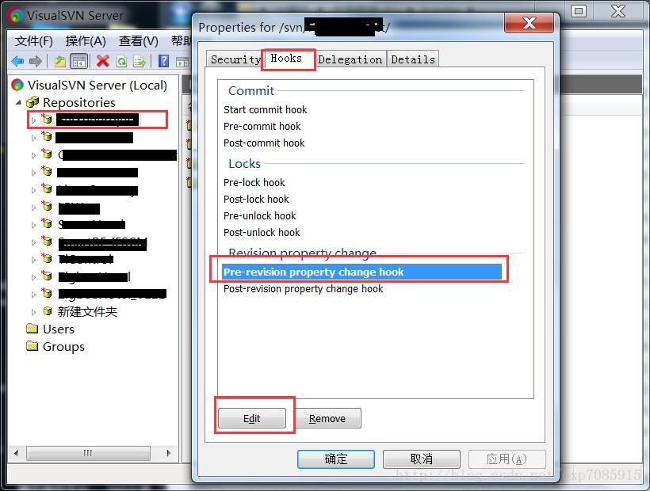

# 备忘录

## Lombok 

> 将 lombok-x.x.x.jar 放到 eclipse.ini 目录  
> -javaagent:lombok-x.x.x.jar 

## 开源库

markdown mvn编译插件：g:org.apache.maven.doxia, a:doxia-module-markdown

## SVN 提交备注修改

在对已经提交的版本进行LOG日志修改出现如下错误：

Repository has not been enabled to accept revision propchanges;
ask the administrator to create a pre-revprop-change hook

查找后发现需要修改版本库中的pre-revprop-change hook中的内容 
我使用的windows 下的VisualSVN Server作为SVN的服务器。打开VisualSVN Server的管
理界面，选择版本库，右击->properties->Hooks ->Pre revision property change hook

SET REPOS="%1"
SET REV="%2"
SET USER="%3"
SET PROPNAME="%4"
SET ACTION="%5"
IF %ACTION% == "M" (IF %PROPNAME% == "svn:log" (EXIT 0))
ECHO "Changing revision properties %PROPNAME% is prohibited" >&2
EXIT 1
